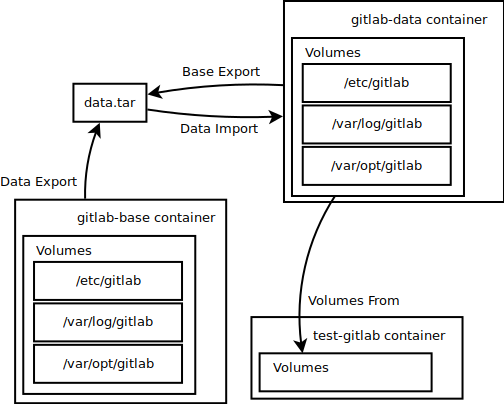

# GitLab Data

This component is provided to serve as a a data-only container for pre-configured GitLab images as well as the utilities to manage, initialize, import and export pre-configured GitLab images though a `data.tar` file containing directories used by GitLab. 

### Creating a new data.tar
1. Initialize a new base GitLab container  
`./manage.sh base init`  

2. Configure GitLab to your liking by logging into at [`http://localhost:8081`](http://localhost:8081)  

3. Export GitLab  
`./manage.sh base export`  

4. Destroy base GitLab when finished  
`./manage.sh base rm`  

### Creating a new gitlab-data container from data.tar
1. Run import command
`./manage.sh data import`

### Testing gitlab-data with GitLab
1. Initialize test GitLab  
`./manage.sh test init`  

2. Use GitLab normally at [`http://localhost:8082`](http://localhost:8082)  
Note: changes made are reflected in the `gitlab-data` container  

3. (Optional) Export changes made by exporting gitlab-data container  
`./manage.sh data export`  
_Note: This will overwrite `data.tar`_  

4. Destroy test GitLab  
`./manage.sh test rm`  
_Note: Changes will persist in `gitlab-data` container_  

### Diagram

### Pre-Configured Data  
- **root user**  
Username: root  
Password: mstsiggame  
Personal Access Token: hDwcksuH_W4-tydjPEhW  
